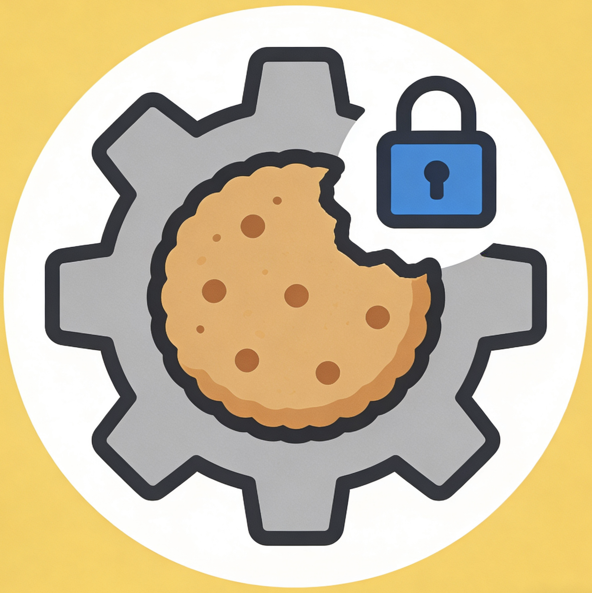

# 🍪 Cookie Manager Pro

<div align="center">
  

  <h3 align="center">
    <strong>高级 Cookie 管理扩展</strong>
  </h3>
  <p align="center">
    智能白名单/黑名单管理，精准控制 Cookie 生命周期<br>
    基于 Plasmo 框架构建，完美兼容 Chrome/Edge 浏览器
  </p>

  <p align="center">
    <a href="https://sonarcloud.io/summary/new_code?id=LX-Addons_Cookie_Manager_Pro">
      
    </a>
    <a href="https://github.com/LX-Addons/Cookie_Manager_Pro/blob/main/LICENSE">
      
    </a>
    <a href="https://github.com/LX-Addons/Cookie_Manager_Pro/actions/workflows/build-and-check.yml">
      
    </a>
    <a href="https://github.com/LX-Addons/Cookie_Manager_Pro/issues">
      
    </a>
  </p>

  <p align="center">
    <a href="#核心功能">核心功能</a> •
    <a href="#快速开始">快速开始</a> •
    <a href="#项目结构">项目结构</a> •
    <a href="#技术栈">技术栈</a>
  </p>
</div>

---

## ✨ 核心功能

### 🛡️ 双模式智能管理

| 模式 | 说明 | 适用场景 |
|:----:|------|----------|
| **白名单模式** | 仅白名单内网站保留 Cookie，其他自动清理 | 保护常用网站登录状态 |
| **黑名单模式** | 仅黑名单内网站清理 Cookie，其他保留 | 针对性清理特定网站 |

### 🍪 Cookie 精准控制

- **实时统计**：总数、当前网站、会话 Cookie、持久 Cookie 一目了然
- **详细信息**：查看 Cookie 名称、值、域名、路径、过期时间、安全属性
- **选择性清理**：全部 Cookie / 仅会话 Cookie / 仅持久 Cookie
- **过期清理**：一键清理所有已过期的 Cookie

### 🤖 自动化清理

- **标签页丢弃**：当标签页被丢弃时自动清理对应 Cookie
- **启动清理**：浏览器启动时自动清理当前标签页 Cookie
- **过期检测**：自动识别并清理过期 Cookie

### 🎨 个性化体验

- **三主题支持**：跟随系统 / 亮色模式 / 暗色模式
- **清理日志**：完整记录清理历史，支持按时间筛选
- **操作反馈**：即时消息提示，操作结果清晰可见

---

## 🚀 快速开始

### 📦 安装依赖

```bash
npm install
```

### 🔧 开发模式

```bash
npm run dev
```

### 📥 加载扩展

1. 打开 `chrome://extensions/` 或 `edge://extensions/`
2. 启用「开发者模式」
3. 点击「加载已解压的扩展程序」
4. 选择 `build/chrome-mv3-dev` 文件夹

### 🏗️ 构建发布

```bash
npm run build
npm run package
```

### ✅ 代码质量

```bash
npm run lint          # ESLint 检查
npm run lint:fix      # 自动修复 ESLint 问题
npm run format        # Prettier 格式化代码
npm run format:check  # 检查代码格式
```

### 🧪 测试

```bash
npm run test          # 运行单元测试
npm run test:ui       # 单元测试 UI 模式
npm run test:coverage # 生成测试覆盖率报告
npm run test:e2e      # 运行 E2E 测试
npm run test:e2e:ui   # E2E 测试 UI 模式
```

---

## 📁 项目结构

```
Cookie_Manager_Pro/
├── 📂 assets/                 # 静态资源
│   └── icon.png               # 扩展图标
├── 📂 components/            # React 组件
│   ├── ClearLog.tsx          # 清理日志
│   ├── CookieList.tsx        # Cookie 列表
│   ├── DomainManager.tsx     # 域名管理
│   ├── Settings.tsx          # 设置面板
│   ├── RadioGroup.tsx        # 单选按钮组
│   └── CheckboxGroup.tsx     # 复选框组
├── 📂 types/                 # TypeScript 类型
│   └── index.ts              # 类型定义
├── 📂 utils/                 # 工具函数
│   └── cleanup.ts            # 清理逻辑
├── 📂 tests/                 # 测试文件
│   ├── e2e/                  # E2E 测试
│   └── unit/                 # 单元测试
├── background.ts             # Service Worker
├── popup.tsx                 # 弹出窗口
├── store.ts                  # 存储管理
├── style.css                 # 全局样式
├── package.json              # 项目配置
├── tsconfig.json             # TypeScript 配置
└── README.md                 # 项目说明
```

---

## 🛠️ 技术栈

| 技术 | 版本 | 说明 |
|:----:|:----:|------|
| **Plasmo** | 0.90.5 | 现代浏览器扩展框架 |
| **React** | 18.2.0 | 前端 UI 框架 |
| **TypeScript** | 5.3.3 | 类型安全开发 |
| **@plasmohq/storage** | 1.10.0 | 扩展存储管理 |
| **Manifest** | V3 | Chrome 扩展规范 |

---

## 🔒 权限说明

### 必需权限

| 权限 | 用途 |
|:----:|------|
| `cookies` | 读取和管理浏览器 Cookie |
| `storage` | 存储设置和名单数据 |
| `tabs` | 获取当前标签页信息 |
| `browsingData` | 清理浏览器缓存数据 |

### 主机权限

| 权限 | 用途 |
|:----:|------|
| `https://*/*` | 管理 HTTPS 网站的 Cookie |
| `http://*/*` | 管理 HTTP 网站的 Cookie |

---

## 🌐 浏览器支持

| 浏览器 | 最低版本 | 状态 |
|:------:|:--------:|:----:|
| Chrome | 90+ | ✅ 完全支持 |
| Edge | 90+ | ✅ 完全支持 |

---

## ⚠️ 隐私声明

- 🔒 所有数据处理均在本地完成
- 🚫 不会收集或上传任何用户数据
- ✅ 严格遵循隐私优先原则

---

## 📄 许可证

本项目采用 [MIT License](https://github.com/LX-Addons/Cookie_Manager_Pro/blob/main/LICENSE) 开源。

---

<div align="center">
  <p>
    <strong>Made with ❤️ for privacy-conscious users</strong>
  </p>
  <p>
    <sub>Copyright © 2026 Cookie Manager Pro. All rights reserved.</sub>
  </p>
</div>
